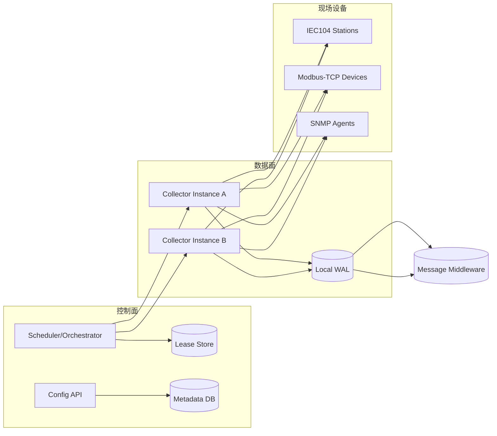
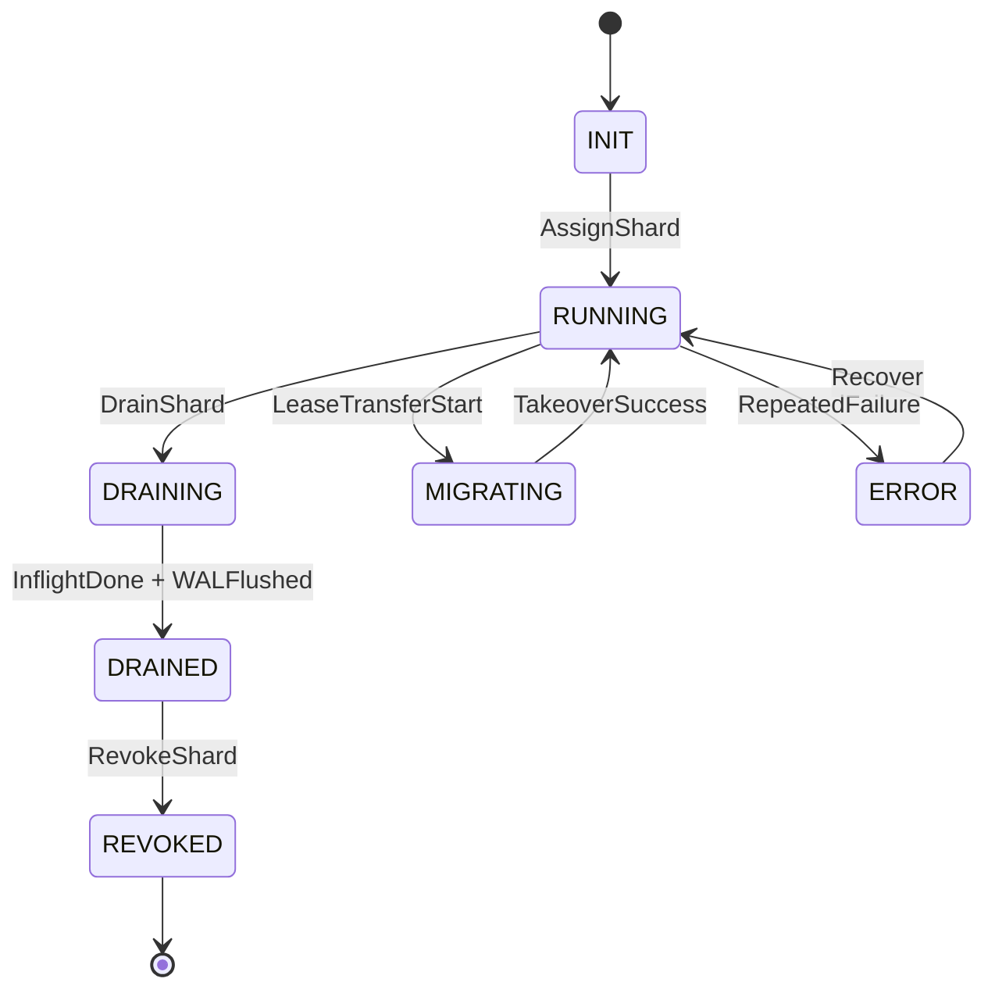
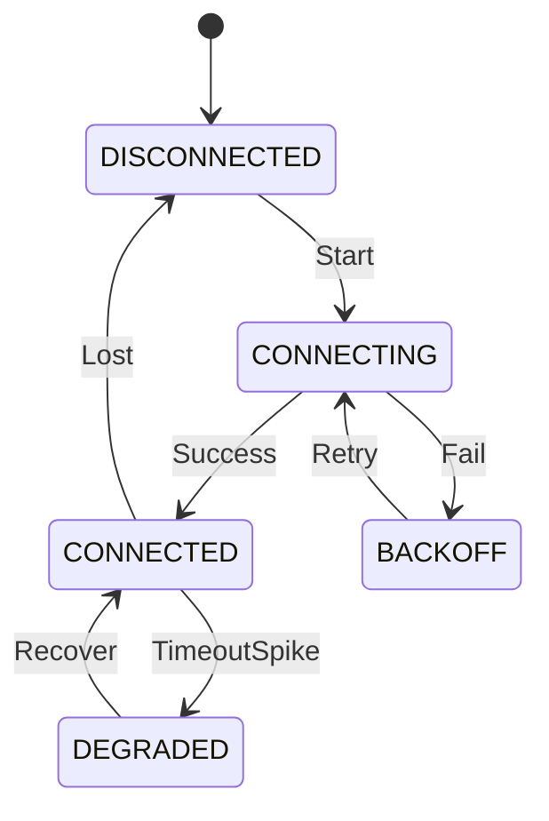
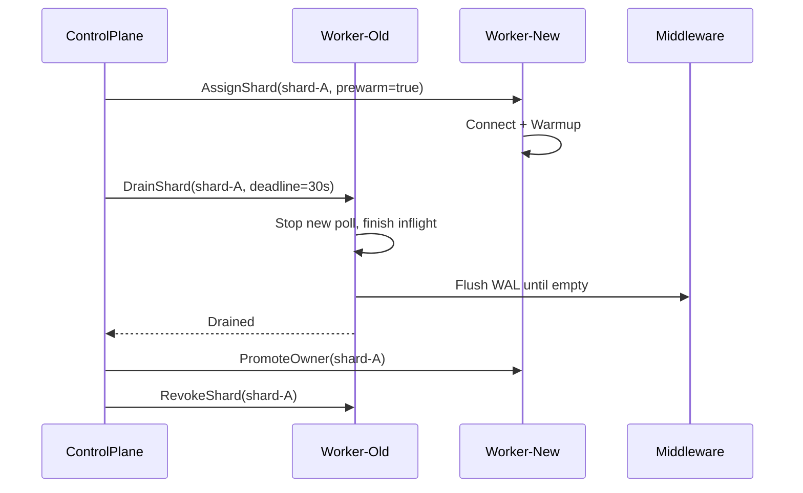
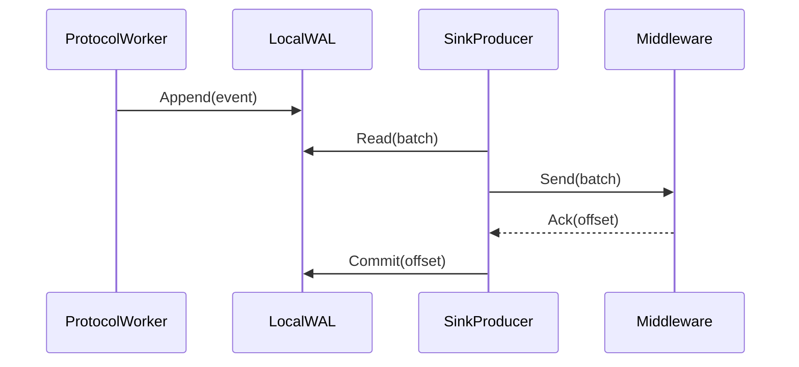

# IEC104/Modbus-TCP/SNMP 采集平台详细技术设计（DESIGN）

## 1. 目标与边界

### 1.1 目标
- 支持海量 TCP/UDP 协议接入：IEC104、Modbus-TCP、SNMP（后续可扩展）。
- 支持按站点/设备配置点表与采集策略。
- 采集数据可靠发送到指定中间件（Kafka/MQTT/Pulsar 等）。
- 支持插件热更新，最小化连接抖动与数据丢失。

### 1.2 非目标
- 不在采集端实现全局 Exactly-once。
- 不在本阶段实现复杂流式计算（聚合、告警规则引擎等）。

## 2. 总体架构



## 3. 逻辑分层

- `Control Plane`
- 配置管理：资源模型、点表版本、策略下发。
- 编排调度：分片分配、故障切换、负载均衡、滚动升级控制。
- 观测管理：实例健康、连接负载、WAL 深度。

- `Data Plane`
- 协议连接与采集执行。
- 结果标准化与缓冲。
- 可靠投递到中间件。

## 3.1 GoFrame 工程基线

本方案整体采用 GoFrame v2，工程形态建议为 `MonoRepo`：

- `app/control-plane`：配置中心 + 调度编排（HTTP/gRPC）
- `app/data-plane`：采集执行面（插件进程/worker）
- `utility/`：共享基础库（中间件客户端、观测封装、错误码）

GoFrame 组件映射建议：
- 配置管理：`gcfg`
- 日志：`glog`（统一 JSON 结构日志）
- 错误：`gerror`（保留堆栈）
- ORM：`gdb`
- 校验：`gvalid`
- HTTP 服务：`g.Server()`
- gRPC 服务：GoFrame gRPC 工程模板（接口层 + service 层）

工程规范：
- 项目骨架优先通过 `gf init` 生成。
- 业务逻辑优先放 `service` 层，不新增 `logic` 层（除非后续明确需要）。
- `dao/do/entity` 由工具维护，不手工改动自动生成内容。

## 4. 分片模型与容量规划

### 4.1 分片单位
- 分片主键：`shard_id`。
- 推荐分片粒度：按站点或设备组（而非按协议大类）。
- 一个分片包含：设备集合 + 点表版本 + 采集策略。

### 4.2 负载指标
- `active_connections`
- `collect_latency_p95`
- `send_lag_ms`
- `wal_depth`
- `cpu_pct` / `mem_pct`

### 4.3 调度策略
- 初始分配：最小连接数优先 + 权重轮询。
- 再平衡阈值：`max_shards - min_shards > 1` 或 `send_lag_ms` 超阈值。
- 硬限制：单实例连接数上限（防雪崩）。

## 5. 数据模型（PostgreSQL 示例）

### 5.1 资源配置表

```sql
create table endpoint (
  id               bigserial primary key,
  endpoint_code    varchar(64) not null unique,
  protocol         varchar(16) not null, -- iec104/modbus_tcp/snmp
  host             varchar(255) not null,
  port             int not null,
  enabled          boolean not null default true,
  auth_ref         varchar(128),
  ext_json         jsonb not null default '{}'::jsonb,
  created_at       timestamptz not null default now(),
  updated_at       timestamptz not null default now()
);

create table point_table (
  id               bigserial primary key,
  endpoint_id      bigint not null references endpoint(id),
  version          int not null,
  status           varchar(16) not null, -- draft/published/archived
  checksum         varchar(64) not null,
  created_at       timestamptz not null default now(),
  published_at     timestamptz,
  unique(endpoint_id, version)
);

create table point_item (
  id               bigserial primary key,
  point_table_id   bigint not null references point_table(id),
  point_code       varchar(64) not null,
  protocol_addr    varchar(128) not null, -- IEC104: ioa / Modbus: addr / SNMP: oid
  value_type       varchar(32) not null,
  collect_cycle_ms int not null,
  qos_level        smallint not null default 1,
  ext_json         jsonb not null default '{}'::jsonb,
  unique(point_table_id, point_code)
);
```

### 5.2 分片与租约表

```sql
create table shard (
  id               bigserial primary key,
  shard_id         varchar(64) not null unique,
  shard_type       varchar(32) not null, -- station_group/device_group
  status           varchar(16) not null, -- running/draining/migrating
  desired_owner    varchar(128),
  point_table_id   bigint not null references point_table(id),
  created_at       timestamptz not null default now(),
  updated_at       timestamptz not null default now()
);

create table shard_lease (
  shard_id         varchar(64) primary key,
  owner_id         varchar(128) not null,
  lease_expire_at  timestamptz not null,
  version          bigint not null,
  updated_at       timestamptz not null default now()
);

create index idx_shard_lease_expire on shard_lease(lease_expire_at);
```

### 5.3 采集与投递状态表

```sql
create table collect_task_status (
  shard_id         varchar(64) not null,
  endpoint_id      bigint not null,
  last_collect_at  timestamptz,
  last_error       text,
  fail_count       int not null default 0,
  updated_at       timestamptz not null default now(),
  primary key(shard_id, endpoint_id)
);

create table delivery_checkpoint (
  shard_id         varchar(64) not null,
  sink_name        varchar(64) not null,
  last_ack_offset  varchar(128),
  updated_at       timestamptz not null default now(),
  primary key(shard_id, sink_name)
);
```

## 6. 控制面接口设计（HTTP/gRPC）

### 6.1 配置管理接口
- `POST /api/v1/endpoints`
- `PUT /api/v1/endpoints/{id}`
- `POST /api/v1/endpoints/{id}/point-tables`
- `POST /api/v1/point-tables/{id}/publish`
- `POST /api/v1/shards/reconcile`

### 6.2 编排接口（控制面 -> 数据面）
- `AssignShard(ShardAssignment)`
- `RevokeShard(shard_id)`
- `DrainShard(shard_id, deadline)`
- `Health()`
- `ReloadConfig(endpoint_id, point_table_version)`

### 6.3 数据上报接口（数据面 -> 控制面）
- `ReportHealth(HealthSnapshot)`
- `ReportMetrics(metrics_batch)`
- `ReportShardEvent(shard_id, state, reason)`

## 7. 数据面内部模块

- `Protocol Worker`
- IEC104 Worker：长连接、总召、时钟同步、命令发送。
- Modbus Worker：寄存器合并读取、设备级串行。
- SNMP Worker：UDP 限速轮询、超时重试模板。

- `Collector Scheduler`
- 按 `collect_cycle_ms` 生成任务。
- 支持优先级队列（高优先级点先采）。

- `Normalizer`
- 统一事件格式，附 `event_id` 与元数据。

- `Local WAL Queue`
- 先落盘再发送。
- 宕机恢复后按 checkpoint 重放。

- `Sink Producer`
- 异步批量发送。
- ACK 后推进 checkpoint，失败重试带退避。

## 8. 标准事件模型

```json
{
  "event_id": "ep1001.p5001.1741161600000.42",
  "endpoint_code": "ep1001",
  "protocol": "iec104",
  "point_code": "P5001",
  "collect_time": "2026-03-05T16:00:00+08:00",
  "value": 1,
  "quality": "GOOD",
  "trace_id": "b8f1f7...",
  "ext": {
    "ioa": 5001,
    "cause": "periodic"
  }
}
```

## 9. 状态机设计

### 9.1 分片状态机



### 9.2 连接状态机（单 endpoint）



## 10. 关键时序图

### 10.1 热升级无损迁移



### 10.2 数据采集与可靠投递



## 11. 可靠性与一致性策略

- 语义：At-least-once。
- 幂等：下游按 `event_id` 去重。
- 重试：指数退避 + 最大重试次数 + 死信队列。
- 回压：
- 一级：降低低优先级点采样频率。
- 二级：限制新分片调度。
- 三级：触发告警并人工介入。

## 12. 可观测性设计

### 12.1 指标
- `collector_active_connections`
- `collector_collect_duration_ms`
- `collector_send_lag_ms`
- `collector_wal_depth`
- `collector_send_retry_total`
- `collector_dropped_total`

### 12.2 日志
- 结构化日志字段：`trace_id/shard_id/endpoint_code/protocol/error_code`。

### 12.3 告警建议
- `wal_depth` 连续 5 分钟增长。
- `send_lag_ms` 超阈值。
- `lease_renew_failed` 连续失败。
- 单实例连接数接近上限。

## 13. 安全设计

- 控制面接口认证鉴权（JWT/OIDC + RBAC）。
- 敏感信息（SNMP community、设备密码）存密钥管理系统。
- 传输链路 TLS（控制面、消息中间件）。
- 审计日志：配置变更、分片迁移、人工干预操作。

## 14. 与当前仓库的落地映射

- `app/data-plane/internal/service/contract/contract.go`
- 扩展 `HealthSnapshot`：增加 `SendLagMs/WALDepth/DrainingState`。
- 扩展 `Plugin`：新增 `DrainShard`、`ReloadConfig`。

- `app/data-plane/internal/service/orchestrator/orchestrator.go`
- 在 `FailoverLostOwners/Rebalance` 基础上增加 `Drain + Promote + Revoke` 三阶段迁移。
- 调度输入由 `ActiveShards` 扩展为多维指标。

- `app/data-plane/internal/service/runtime/iec104_plugin.go`
- 增加本地 WAL 队列模块与 checkpoint。
- `AssignShard` 支持 `prewarm` 参数。
- `Stop/RevokeShard` 走 draining 流程。

- `app/data-plane/internal/service/hostloader/hostloader.go`
- 增加升级演练命令：`assign -> drain -> promote -> revoke`。

## 15. 实施路线图

### Phase 1（1~2 周）
- 完成统一资源模型与配置存储。
- 增加 `DrainShard` 接口与分片状态机。

### Phase 2（2~4 周）
- 实现 WAL + checkpoint + 重放。
- 接入一种中间件（Kafka 优先）并压测。

### Phase 3（2~3 周）
- 实现多维调度与自动 rebalance。
- 完成滚动升级与灰度迁移策略。

### Phase 4（持续）
- 协议性能优化、可观测性完善、容量调优。

## 16. 验收标准

- 单实例故障：分片 30 秒内接管。
- 滚动升级：业务可接受窗口内无批量丢数。
- 中间件抖动：WAL 可持续缓冲并最终补发。
- 高峰压测：达到目标连接数与吞吐指标，CPU/内存受控。

## 17. 概念字典与原理详解

### 17.1 控制面（Control Plane）
- 定义：系统“大脑”，负责配置、调度、升级和治理，不直接采集协议数据。
- 原理：通过“声明式目标状态”驱动数据面实例收敛到期望状态。
- 关键职责：
- 配置生命周期：创建、发布、回滚。
- 分片生命周期：分配、迁移、回收。
- 健康治理：故障识别、限流、摘除。

### 17.2 数据面（Data Plane）
- 定义：系统“执行层”，负责建连、采集、转换、投递。
- 原理：实例无状态化（控制状态在外部），运行态状态最小化并可恢复。
- 关键职责：
- 协议连接管理。
- 采集任务调度。
- 可靠投递与重试。

### 17.3 Endpoint（端点）
- 定义：一个可连接的数据源目标（如 IEC104 站、Modbus 设备、SNMP Agent）。
- 字段核心：`protocol + host + port + auth_ref + ext_json`。
- 原理：将协议差异封装在 `ext_json` 和协议 worker 中，资源层保持统一模型。

### 17.4 Point Table（点表）
- 定义：端点的可采集点位集合与采集策略。
- 原理：版本化发布（`draft -> published`），运行时始终绑定一个确定版本，确保可回滚。
- 关键字段：`protocol_addr`、`value_type`、`collect_cycle_ms`、`qos_level`。

### 17.5 Shard（分片）
- 定义：可独立调度/迁移的最小工作单元。
- 原理：一个分片可包含多个 endpoint，但必须保证“迁移时可整体排空”。
- 设计原则：
- 不宜过大：迁移慢、故障影响面大。
- 不宜过小：调度开销高、连接抖动频繁。

### 17.6 Lease（租约）
- 定义：分片归属权的时间约束令牌，含 `owner_id + lease_expire_at + version`。
- 原理：
- Owner 周期续租；续租失败且过期后，其他实例可接管。
- 通过版本号避免并发写覆盖（CAS 语义）。

### 17.7 WAL（Write-Ahead Log）
- 定义：发送前日志，采集数据先落盘再发。
- 原理：
- 先持久化，后投递；ACK 后再提交 checkpoint。
- 进程崩溃后按 checkpoint 重放未确认数据。
- 效果：显著降低重启/升级/抖动导致的数据丢失风险。

### 17.8 Checkpoint（投递位点）
- 定义：已成功发送并被中间件确认的“进度游标”。
- 原理：消费者恢复时从 checkpoint 之后继续发送，保证至少一次语义。

### 17.9 Backpressure（回压）
- 定义：当下游处理能力低于上游产出时，系统主动减载。
- 原理：分级降级而非直接阻塞：降频 -> 限流 -> 暂停低优先级 -> 告警。

### 17.10 Idempotency（幂等）
- 定义：同一事件重复投递，多次处理结果等价。
- 原理：事件携带稳定唯一键 `event_id`，下游按键去重。

## 18. 分片状态机详细解释

### 18.1 为什么要有 DRAINING/DRAINED
- 没有这两个状态，迁移通常是“直接断开”，在途采集任务和待发送缓存会丢。
- 加入排空阶段后，迁移顺序变成：停止新任务 -> 完成在途 -> flush WAL -> 回收分片。

### 18.2 每个状态的入口动作与退出条件
- `INIT`
- 入口动作：加载配置、建立连接、预热缓存。
- 退出条件：关键连接 ready、点表装载成功。

- `RUNNING`
- 入口动作：开启调度器，开始采集和投递。
- 退出条件：收到 `DrainShard` 或迁移信号。

- `DRAINING`
- 入口动作：停止新增任务，保留在途任务与重试发送。
- 退出条件：`inflight_jobs=0 && wal_depth=0 && silence_window_ok`。

- `DRAINED`
- 入口动作：冻结分片写入，等待控制面切换 owner。
- 退出条件：收到 `RevokeShard`。

- `REVOKED`
- 入口动作：释放连接、清理本地运行态。
- 退出条件：无，生命周期结束。

- `ERROR`
- 入口动作：记录错误码和失败原因，触发告警。
- 退出条件：重试恢复成功或人工介入。

### 18.3 强一致切换建议
- 控制面迁移顺序固定：`Assign(prewarm) -> Drain(old) -> Promote(new lease owner) -> Revoke(old)`。
- 任一步失败可回滚到 `RUNNING(old owner)`，避免双写或双 owner。

## 19. 调度与负载均衡原理

### 19.1 调度目标函数
- 目标不是“分片数平均”，而是“综合成本最小”。
- 推荐权重模型：
- `score = w1*active_connections + w2*send_lag_ms + w3*wal_depth + w4*cpu_pct`

### 19.2 再平衡触发
- 周期触发：如每 30s。
- 事件触发：实例下线、租约过期、指标突增。
- 抖动保护：设置最短迁移间隔（cooldown），避免频繁搬迁。

### 19.3 故障切换
- 判定：`health timeout` 或 `lease expired`。
- 策略：优先把分片给低负载且协议能力匹配的实例。

## 20. 协议采集原理详解

### 20.1 IEC104
- 特性：长连接、状态驱动、常见总召/时钟同步命令。
- 原理：
- 连接建立后先进行就绪动作（如总召）。
- 命令通道与采集回调并存，需共享状态并发控制。

### 20.2 Modbus-TCP
- 特性：请求-响应、寄存器连续区间可合并。
- 原理：
- 同设备串行，跨设备并行。
- 合并地址段减少 RTT 与设备压力。

### 20.3 SNMP
- 特性：UDP、天然不可靠、受丢包与超时影响大。
- 原理：
- 采用超时与重试模板。
- 使用 token-bucket 控制瞬时轮询速率。

## 21. 可靠投递与数据语义

### 21.1 At-least-once 的本质
- 允许重复，不允许无声丢失。
- 重复由幂等机制消解，丢失由 WAL + checkpoint 避免。

### 21.2 发送流水线
- `collect -> normalize -> wal append -> batch send -> ack -> checkpoint commit`
- 任何阶段失败都可从 WAL 重试，不依赖内存态。

### 21.3 死信策略
- 重试超过阈值后进入 DLQ，并保留原始 payload 与错误码。
- 需提供人工重放工具，支持按 shard/time 窗口回灌。

## 22. 升级与发布机制原理

### 22.1 滚动升级
- 每批迁移固定比例分片（如 5%-10%）。
- 观察窗口内指标稳定再推进下一批。

### 22.2 蓝绿/灰度
- 新版本先接管少量分片做真实流量验证。
- 异常时快速回切旧版本 owner。

### 22.3 无损升级判定
- 迁移窗口内：
- `wal_depth` 不持续增长。
- `send_lag_ms` 不超过阈值。
- 无异常增量丢弃计数。

## 23. 常见误区与设计准则

### 23.1 常见误区
- 误区 1：按协议类型大分片，导致热点集中。
- 误区 2：只看分片数不看连接质量和发送滞后。
- 误区 3：升级时直接重启实例，忽略 draining。
- 误区 4：把幂等责任放在采集端而不是下游消费端。

### 23.2 设计准则
- 准则 1：控制状态外置（租约、配置、checkpoint）。
- 准则 2：迁移必须可观测、可回滚。
- 准则 3：协议层和投递层解耦，故障域隔离。
- 准则 4：先保证不丢，再优化不重。

## 24. SLA/SLO 与错误预算（评审基线）

### 24.1 服务等级目标（建议初版）

| 维度 | 指标 | 目标值 | 统计窗口 |
|---|---|---:|---|
| 可用性 | 采集服务可用性 | >= 99.95% | 月 |
| 时效性 | 端到端延迟 P95 | <= 3s | 5 分钟滑窗 |
| 时效性 | 端到端延迟 P99 | <= 10s | 5 分钟滑窗 |
| 可靠性 | 丢数率 | <= 0.001% | 日 |
| 稳定性 | 分片迁移成功率 | >= 99.9% | 周 |
| 恢复性 | 单实例故障接管时长 | <= 30s | 事件 |

### 24.2 SLI 定义
- `availability = 1 - (unavailable_seconds / total_seconds)`
- `e2e_latency = sink_ack_time - collect_time`
- `loss_rate = (produced_events - eventually_acked_events) / produced_events`
- `handover_time = new_owner_running_time - old_owner_failure_time`

### 24.3 错误预算
- 月度错误预算：`(1 - 99.95%) * 30 * 24 * 3600 = 1296s`。
- 预算使用策略：
- 使用 > 50%：冻结非必要变更，仅允许修复类发布。
- 使用 > 80%：进入变更管控，必须通过演练回归后再发布。

## 25. 容量规划与估算公式

### 25.1 变量定义
- `N`: 设备/端点总数
- `P`: 单设备点位数均值
- `T`: 平均采集周期（秒）
- `B`: 单条事件平均字节数（含协议头）
- `R`: 重试放大系数（正常 1.0~1.2）
- `K`: 副本冗余系数（如双写/双副本）

### 25.2 吞吐估算
- 事件速率：`EPS = N * P / T`
- 带宽需求：`Bandwidth(bytes/s) = EPS * B * R * K`
- 例：`N=10,000, P=80, T=10s, B=220, R=1.1, K=1`
- `EPS = 80,000`
- `Bandwidth ≈ 19.36 MB/s`

### 25.3 WAL 空间估算
- `WAL_size = EPS * B * backlog_seconds`
- 例：按上例，若要抗 20 分钟下游抖动：
- `WAL_size ≈ 80,000 * 220 * 1200 ≈ 21.1 GB`
- 建议预留：`>= 2.0x` 安全系数。

### 25.4 实例数估算
- 单实例可承载事件率记为 `eps_per_instance`（压测得到）。
- `instance_count = ceil(EPS / (eps_per_instance * target_utilization))`
- `target_utilization` 建议 0.6~0.7。

### 25.5 连接容量基线
- IEC104：按“连接数 + 命令峰值”双维压测。
- Modbus-TCP：按“每设备 RTT + 并发设备数”压测。
- SNMP：按“UDP 丢包率 + 重试率”压测。

## 26. 故障演练（GameDay）与验收用例

### 26.1 演练场景清单

| 场景 | 注入方式 | 期望结果 | 验收标准 |
|---|---|---|---|
| 单实例宕机 | kill -9 采集进程 | 分片自动接管 | 30s 内恢复 RUNNING |
| 中间件抖动 | 限制 broker 吞吐/增加延迟 | WAL 增长可控，最终补发 | 无永久丢数 |
| 网络分区 | 断开部分设备网络 | 连接重试与告警生效 | 恢复后自动回连 |
| 配置错误发布 | 推送错误点表版本 | 可快速回滚 | 5 分钟内恢复 |
| 租约存储故障 | 阻断 lease store | 不发生双 owner | 自动降级 + 告警 |

### 26.2 标准演练步骤
1. 设定演练窗口与回滚阈值。
2. 记录基线指标（延迟、WAL、丢弃计数）。
3. 注入故障并持续观测。
4. 按 Runbook 处置并回滚。
5. 输出复盘：根因、修复项、时限。

### 26.3 必备 Runbook 条目
- 分片卡在 `DRAINING` 如何处理。
- WAL 持续增长如何分级止损。
- 新版本灰度失败如何一键回切。
- 租约脑裂风险如何人工仲裁。

## 27. 接口字段级定义（契约草案）

### 27.1 AssignShard

```json
{
  "shard_id": "shard-cn-east-1-a",
  "owner_id": "collector-10.0.1.8",
  "version": 12,
  "lease_expire": "2026-03-05T17:30:00+08:00",
  "prewarm": true,
  "stations": [
    {
      "station_id": "station-1001",
      "protocol": "iec104",
      "host": "10.2.1.10",
      "port": 2404,
      "common_addr": 1,
      "auto_connect": true,
      "point_table_version": 7,
      "collect_policy": {
        "default_cycle_ms": 1000,
        "jitter_ms": 100,
        "timeout_ms": 1500,
        "retry": 2
      }
    }
  ]
}
```

字段说明：
- `version`: 分片配置版本，必须单调递增，防旧配置覆盖。
- `prewarm`: 仅建连与预热，不立刻承担最终 owner 写入职责。
- `collect_policy`: 允许站点级覆盖默认采集参数。

### 27.2 DrainShard

```json
{
  "shard_id": "shard-cn-east-1-a",
  "deadline_ms": 30000,
  "reason": "rolling_upgrade",
  "require_wal_flush": true
}
```

字段说明：
- `deadline_ms`: 排空超时时间，超时后由控制面决定强制回收或延期。
- `require_wal_flush`: 为 true 时必须 `wal_depth=0` 才能进入 `DRAINED`。

### 27.3 HealthSnapshot（扩展）

```json
{
  "instance_id": "collector-10.0.1.8",
  "alive": true,
  "heartbeat_at": "2026-03-05T17:00:00+08:00",
  "active_shards": 42,
  "active_conn": 380,
  "event_queue_depth": 1200,
  "command_fail_rate": 0.003,
  "send_lag_ms": 800,
  "wal_depth": 20480,
  "draining_shards": 3,
  "cpu_pct": 61.5,
  "mem_pct": 58.2
}
```

字段说明：
- `send_lag_ms`: 当前采集到投递 ACK 的滞后。
- `wal_depth`: 待发送 WAL 条目数或字节数（需统一单位）。
- `draining_shards`: 用于控制面判断迁移进度。

### 27.4 ReportShardEvent

```json
{
  "shard_id": "shard-cn-east-1-a",
  "instance_id": "collector-10.0.1.8",
  "from_state": "RUNNING",
  "to_state": "DRAINING",
  "reason": "rolling_upgrade",
  "at": "2026-03-05T17:00:12+08:00",
  "ext": {
    "inflight_jobs": 12,
    "wal_depth": 1024
  }
}
```

用途：
- 控制面可回放状态迁移轨迹。
- 支持故障后追溯与 SLA 计算。

## 28. 评审结论模板（供架构评审会使用）

### 28.1 评审输入
- 目标流量与连接规模。
- 目标中间件与 SLA。
- 硬件资源预算。

### 28.2 评审检查项
- 分片粒度是否可迁移、可排空。
- 租约机制是否具备防脑裂约束。
- WAL + checkpoint 是否闭环。
- 升级流程是否具备回滚路径。
- GameDay 是否覆盖关键故障域。

### 28.3 评审输出
- 通过/有条件通过/不通过。
- 风险清单与 owner。
- 上线前必须完成项（阻断项）与截止日期。
